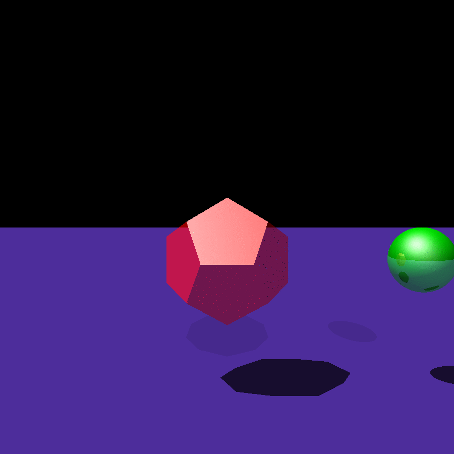

# rust-raytracer
A toy raytracer project built as part of learning Rust.  Renders a fixed scene from a number of
angles which can be stitched together with ImageMagick to form a smooth animation. (This process
causes some artifacting and loss of color accuracy due to the gif limit of 256 colors
per frame.)

